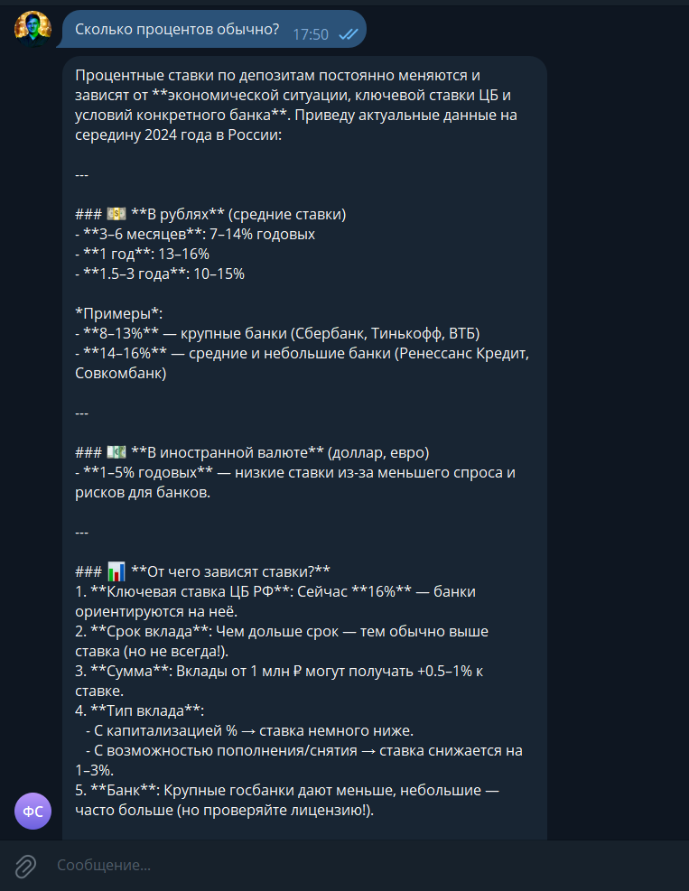

# Отчёт о выполнении задания

## Название проекта и краткое описание

**AIDD** (AI-Driven Development) — Telegram-бот с LLM-ассистентом в роли финансового советника. Проект представляет собой интеллектуального помощника, который помогает пользователям с финансовыми вопросами, даёт советы по управлению финансами, инвестициям и планированию бюджета. Бот использует современные LLM-модели через OpenRouter API для генерации контекстуальных ответов с учётом истории диалога.

## Выбранная роль ИИ-ассистента и её обоснование

**Роль: Финансовый советник**

Выбор роли финансового советника обоснован следующими факторами:

- **Практическая ценность**: Финансовая грамотность — актуальная тема для широкой аудитории. Пользователи часто нуждаются в консультациях по управлению финансами, но не всегда имеют доступ к профессиональным консультантам.

- **Чёткая область применения**: Финансы — структурированная область знаний, где LLM может предоставлять полезные советы и информацию, оставаясь в рамках общих рекомендаций.

- **Возможность демонстрации контекста**: Финансовые вопросы часто требуют уточнений и последующих вопросов, что позволяет продемонстрировать работу истории диалога и контекстного понимания.

- **Безопасность**: В отличие от медицинских или юридических советов, финансовая информация менее критична с точки зрения ответственности, что делает её подходящей для демонстрационного проекта.

## Реализованные возможности

- [x] Настройка проекта с использованием `uv` для управления зависимостями
- [x] Базовый Telegram-бот с использованием aiogram (polling)
- [x] Команда `/start` для начала диалога
- [x] Интеграция с LLM через OpenRouter API
- [x] Системный промпт для роли финансового советника
- [x] Хранение истории диалога в памяти (до 10 последних сообщений)
- [x] Контекстное понимание диалога — бот помнит предыдущие сообщения
- [x] Обработка ошибок API (OpenRouter, Telegram)
- [x] Таймауты для запросов к LLM (60 секунд)
- [x] Информативные сообщения об ошибках пользователю
- [x] Улучшенное логирование с указанием user_id
- [x] Редактирование сообщения "Обрабатываю запрос..." на ответ от LLM

## Технологический стек

### Основные технологии

- **Python 3.11+** — основной язык разработки
- **aiogram 3.22.0** — асинхронный фреймворк для Telegram Bot API
- **openai 2.8.1** — клиент для работы с OpenAI-совместимыми API (используется для OpenRouter)
- **python-dotenv 1.2.1** — загрузка переменных окружения из `.env` файла

### Инструменты разработки

- **uv** — современный менеджер зависимостей и виртуальных окружений для Python
- **make** — автоматизация сборки и запуска проекта
- **hatchling** — система сборки Python-пакетов

### Инфраструктура

- **OpenRouter API** — агрегатор LLM-моделей для доступа к различным языковым моделям
- **Telegram Bot API** — платформа для создания и работы ботов

## Инструменты AI-driven разработки

### Используемая AI-coding IDE

**Cursor** — AI-powered IDE с интеграцией языковых моделей для генерации кода, рефакторинга и помощи в разработке.

### Используемые LLM модели для генерации документации и кода

- **Composer (Cursor)** — основная модель для генерации кода и документации в процессе разработки
- **tngtech/deepseek-r1t2-chimera:free** — модель, используемая ботом для генерации ответов пользователям (через OpenRouter)

## Скриншот работы

На скриншоте видно пример диалога с ботом, где пользователь задаёт вопрос "Сколько процентов обычно?" в контексте предыдущего обсуждения депозитов. Бот предоставляет подробный ответ с актуальной информацией о процентных ставках по депозитам в России, структурированный по разделам (в рублях, в иностранной валюте, факторы влияния).

## Процесс разработки: основные вызовы и решения

### Итеративный подход

Разработка велась по принципу итеративного планирования с 6 последовательными итерациями:

1. **Настройка проекта** — создание структуры, настройка зависимостей
2. **Базовый Telegram-бот** — реализация простого эхо-бота
3. **Интеграция с LLM** — подключение OpenRouter API
4. **Системный промпт** — добавление роли финансового советника
5. **История диалога** — реализация контекстного понимания
6. **Обработка ошибок** — улучшение стабильности и UX

### Основные вызовы

1. **Проблемы с кодировкой файла `.env`**
   - **Проблема**: Файл `.env` создавался в неправильной кодировке (UTF-16 с BOM), что вызывало ошибки при загрузке через `python-dotenv`
   - **Решение**: Пересоздание файла через Python с явным указанием кодировки UTF-8 без BOM

2. **Настройка OpenRouter API**
   - **Проблема**: Первоначальные ошибки авторизации и недостатка кредитов
   - **Решение**: Использование правильных заголовков API, обработка специфичных ошибок с понятными сообщениями пользователю

3. **Реализация истории диалога**
   - **Проблема**: Необходимость хранить контекст для каждого пользователя отдельно
   - **Решение**: Использование словаря в памяти (user_id -> список сообщений) с ограничением размера истории

4. **UX при обработке запросов**
   - **Проблема**: Пользователь видел два сообщения — "Обрабатываю запрос..." и ответ
   - **Решение**: Редактирование сообщения вместо отправки нового, с fallback на новое сообщение при ошибке редактирования

### Принципы разработки

Проект разработан с соблюдением принципов **KISS** (Keep It Simple, Stupid) и **YAGNI** (You Aren't Gonna Need It):

- Минимальная структура проекта без избыточных абстракций
- Простое хранение истории в памяти без использования БД
- Прямолинейная обработка ошибок без сложных иерархий исключений
- Только необходимый функционал для проверки идеи

## Что узнал нового в процессе AI-driven разработки

Весьма удобный инструмент. Хочу использовать не только в работе, но и для личных проектов.

AI-driven разработка показала следующие преимущества:

- **Ускорение разработки**: Генерация кода и документации происходит значительно быстрее, чем ручное написание
- **Качество кода**: AI помогает следовать best practices и предлагает оптимальные решения
- **Итеративный процесс**: Возможность быстро согласовывать решения перед реализацией ускоряет разработку
- **Документирование**: Автоматическая генерация документации и комментариев экономит время
- **Обучение**: AI объясняет решения и предлагает альтернативные подходы, что способствует обучению

Особенно полезным оказался процесс согласования решений перед реализацией, что позволило избежать лишних итераций и создать простое, но функциональное решение.

## Ссылка на работающего бота

[@finanse_helper_LLM_bot](https://t.me/finanse_helper_LLM_bot)

