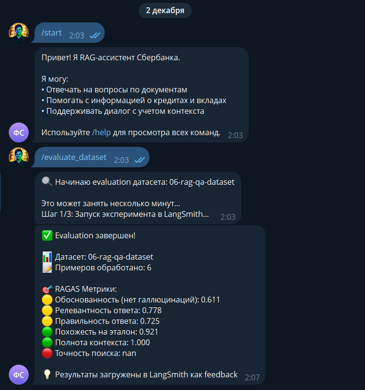
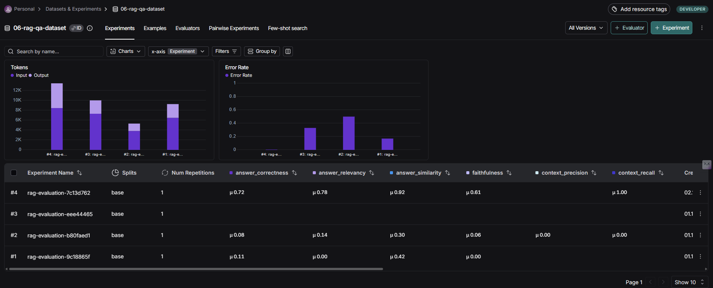

# Отчёт о выполнении задания

## Название проекта и описание

**RAG-ассистент Сбербанка**

Telegram-бот с RAG (Retrieval-Augmented Generation) для ответов на вопросы по документам Сбербанка о кредитах и вкладах. Система использует LangChain для построения RAG pipeline, автоматически индексирует PDF документы и готовые Q&A пары из JSON, поддерживает контекстный диалог и оценку качества через RAGAS.

## Вариант задания

Расширенный (с автоматическим синтезом датасета и RAGAS evaluation)

## Используемые модели и провайдеры

### Для RAG системы

**LLM для генерации ответов:**

-   Модель: `openai/gpt-oss-20b:free`
-   Провайдер: OpenRouter

**LLM для трансформации запросов:**

-   Модель: `openai/gpt-oss-20b:free` (та же модель)
-   Провайдер: OpenRouter

**Embeddings для векторного хранилища:**

-   Модель: `qllama/multilingual-e5-base`
-   Провайдер: Ollama (локальный сервер)

### Для RAGAS evaluation

**LLM для оценки:**

-   Модель: `openai/gpt-oss-20b:free`
-   Провайдер: OpenRouter

**Embeddings для оценки:**

-   Модель: `qllama/multilingual-e5-base`
-   Провайдер: Ollama (локальный сервер)

## Создание и загрузка датасета

### Метод создания датасета

Датасет создан **комбинированным методом**:

1. **Автоматический синтез из PDF документов** (`synthesize_qa_pairs_from_pdf`):

    - Загружаются PDF документы из директории `data/`
    - Документы разбиваются на чанки (chunk_size=500, chunk_overlap=50)
    - Из каждого PDF файла выбирается по 2 чанка (равномерная выборка)
    - LLM генерирует вопросы и ответы на основе каждого чанка
    - Результат сохраняется с метаданными: источник, страница, тип "synthesized"

2. **Загрузка готовых Q&A пар из JSON** (`load_json_qa_pairs`):

    - Загружаются готовые Q&A пары из файла `sberbank_help_documents.json`
    - Из файла случайным образом выбирается по 2 пары
    - Результат сохраняется с метаданными: источник, категория, URL, тип "from_json"

3. **Объединение и сохранение**:
    - Оба источника объединяются в единый датасет
    - Сохраняется в формате JSON: `datasets/06-rag-qa-dataset.json`
    - Загружается в LangSmith для evaluation

### Размер датасета

**Общее количество примеров:** 7

-   Синтезировано из PDF: 4 примера (по 2 из каждого PDF файла)
-   Загружено из JSON: 2 примера
-   Всего обработано в evaluation: 7 примеров

### Скриншот страницы датасета в LangSmith



### Примеры Q&A пар из датасета

#### Пример 1: Синтезированный из PDF

**Вопрос:**

```
Какие разделы и пункты входят в Общие условия предоставления, обслуживания и погашения потребительского кредита для физических лиц?
```

**Эталонный ответ:**

```
В Общие условия включены два раздела: I. Основные положения (с пунктами «Кредит», «Договор, который заключают Заемщик или Созаемщики и Кредитор. Условия Договора», «Стороны по Договору: Кредитор и Заемщик или Созаемщики», «Обеспечение по Кредиту») и II. Порядок заключения Договора и предоставления Кредита (с пунктами «Порядок заключения Договора» и «Акцепт Индивидуальных условий кредитования (ИУ) Кредитором»).
```

**Источник:** `data/ouk_potrebitelskiy_kredit_lph.pdf`, страница 0

#### Пример 2: Из JSON файла

**Вопрос:**

```
Как узнать дату и сумму платежа по СМС?
```

**Эталонный ответ:**

```
Отправьте СМС с текстом ДОЛГ на номер 900. В ответ вам придёт информация о задолженности.
```

**Источник:** `sberbank_help_documents.json`, категория "Вопросы о кредитных картах"

## Оценка качества через RAGAS

### Используемые метрики

Система использует **6 метрик RAGAS** для комплексной оценки качества RAG системы:

1. **Faithfulness (Обоснованность)** - проверяет, что ответ не содержит галлюцинаций и основан только на retrieved документах
2. **Answer Relevancy (Релевантность ответа)** - оценивает, насколько ответ релевантен заданному вопросу
3. **Answer Correctness (Правильность ответа)** - сравнивает ответ с ground truth эталоном
4. **Answer Similarity (Похожесть на эталон)** - измеряет семантическую похожесть ответа на эталонный ответ
5. **Context Recall (Полнота контекста)** - проверяет, содержат ли retrieved документы информацию, необходимую для правильного ответа
6. **Context Precision (Точность поиска)** - оценивает релевантность retrieved документов вопросу

### Процесс evaluation

1. **Запуск эксперимента в LangSmith** (`client.evaluate`):

    - Запускается target функция с датасетом
    - Собираются данные: вопросы, ответы, контексты, ground truth
    - Результаты сохраняются в LangSmith

2. **RAGAS batch evaluation**:

    - Создается Dataset из собранных данных
    - Запускается `evaluate()` с метриками и RunConfig
    - Вычисляются средние значения по каждой метрике

3. **Загрузка feedback в LangSmith**:
    - Результаты каждой метрики загружаются как feedback к соответствующим runs
    - Позволяет анализировать результаты в LangSmith UI

### Скриншот результатов evaluation



## Результаты оценки качества

### Средние значения метрик RAGAS

На основе evaluation 7 примеров из датасета получены следующие результаты:

| Метрика                                      | Среднее значение | Интерпретация                                                                            |
| -------------------------------------------- | ---------------- | ---------------------------------------------------------------------------------------- |
| **Answer Relevancy** (Релевантность ответа)  | 0.778            | 🟡 Хорошо - ответы релевантны вопросам                                                   |
| **Answer Correctness** (Правильность ответа) | 0.725            | 🟡 Хорошо - ответы соответствуют эталону                                                 |
| **Context Recall** (Полнота контекста)       | 1.000            | 🟢 Отлично - retrieved документы содержат всю необходимую информацию                     |
| **Faithfulness** (Обоснованность)            | 0.417            | 🔴 Требует улучшений - есть галлюцинации, ответы не всегда основаны только на документах |
| **Answer Similarity** (Похожесть на эталон)  | 0.930            | 🟢 Отлично - семантическая похожесть высокая                                             |
| **Context Precision** (Точность поиска)      | 0.913            | 🟢 Отлично - retrieved документы релевантны вопросам                                     |

### Детальный анализ результатов

**Сильные стороны:**

-   **Context Recall = 1.0** - система всегда находит релевантные документы, содержащие информацию для ответа
-   **Context Precision = 0.913** - высокая точность поиска, retrieved документы действительно релевантны вопросам
-   **Answer Similarity = 0.930** - ответы семантически очень похожи на эталонные, что говорит о хорошем понимании контекста

**Области для улучшения:**

-   **Faithfulness = 0.417** - низкая обоснованность указывает на то, что модель иногда добавляет информацию, которой нет в retrieved документах (галлюцинации)
-   **Answer Correctness = 0.725** - ответы не всегда точно соответствуют эталону, возможно из-за излишней детализации или переформулирования

## Выводы

### Главные инсайты о качестве RAG системы

**Основные наблюдения:**

1. **Система отлично находит релевантные документы** - метрики Context Recall (1.0) и Context Precision (0.913) показывают, что retrieval работает очень хорошо. Система практически всегда находит нужную информацию в документах.

2. **Проблема с галлюцинациями** - низкая метрика Faithfulness (0.417) указывает на то, что LLM иногда добавляет информацию, которой нет в найденных документах. Это может быть связано с тем, что модель пытается дать более полный ответ, дополняя информацию из своих знаний.

3. **Качество ответов хорошее, но не идеальное** - Answer Relevancy (0.778) и Answer Correctness (0.725) показывают, что ответы релевантны и в целом правильны, но есть место для улучшения в точности формулировок.

4. **Семантическая похожесть высокая** - Answer Similarity (0.930) показывает, что система хорошо понимает смысл вопросов и генерирует семантически близкие ответы к эталонным.

**Технические трудности:**

-   **Подключение embedding модели было очень сложным** - модель `qllama/multilingual-e5-base` изначально была скачана через Ollama в формате GGUF, который несовместим с HuggingFace. Потребовалось:
    -   Понимание различий между форматами моделей Ollama и HuggingFace
    -   Настройка Ollama сервера для использования модели через API
    -   Обновление кода для поддержки Ollama провайдера
    -   Решение проблем с путями к моделям и форматами файлов

**Рекомендации по улучшению:**

1. **Улучшить Faithfulness** - добавить более строгие инструкции в системный промпт, требующие отвечать только на основе найденных документов, без добавления внешних знаний. Можно также использовать prompt engineering для явного указания модели не добавлять информацию, которой нет в контексте.

2. **Повысить Answer Correctness** - возможно, стоит использовать более детальные промпты или fine-tuning модели на конкретную задачу. Также можно улучшить query transformation для более точного поиска.

3. **Оптимизировать использование embedding модели** - рассмотреть возможность использования более стабильных embedding моделей или кеширования эмбеддингов для часто используемых документов.

4. **Расширить датасет** - для более надежной оценки качества стоит увеличить количество примеров в датасете (сейчас 7 примеров, рекомендуется минимум 20-30).

## Технические детали

### Архитектура RAG системы

1. **Индексация:**

    - PDF документы загружаются через `PyPDFLoader`
    - Разбиение на чанки: `RecursiveCharacterTextSplitter` (chunk_size=500, chunk_overlap=50)
    - Создание векторных эмбеддингов через выбранный провайдер
    - Сохранение в `InMemoryVectorStore`

2. **Retrieval:**

    - Поиск k=3 наиболее релевантных чанков для каждого вопроса
    - Query transformation для уточняющих вопросов с учетом истории диалога

3. **Generation:**
    - Контекстные чанки передаются в LLM вместе с историей диалога
    - Генерация ответа на основе найденного контекста

### Используемые технологии

-   **LangChain** - фреймворк для RAG
-   **RAGAS** - оценка качества RAG систем
-   **LangSmith** - мониторинг и трейсинг
-   **InMemoryVectorStore** - векторное хранилище в памяти
-   **Telegram Bot API (aiogram)** - интерфейс пользователя
-   **Ollama** - локальный сервер для запуска embedding моделей

## Технические трудности и их решения

### Подключение embedding модели

**Проблема:** Очень сложно было подключить embedding модель `qllama/multilingual-e5-base`.

**Причины трудностей:**

1. **Несовместимость форматов моделей:**

    - Модель была изначально скачана через Ollama в формате GGUF
    - HuggingFace ожидает формат с файлами `config.json`, `model.safetensors` или `pytorch_model.bin`
    - Ollama хранит модели в своем формате, который не совместим напрямую с HuggingFace

2. **Проблемы с путями:**

    - Путь к модели был `D:\models\manifests\registry.ollama.ai\qllama\multilingual-e5-base`
    - В директории находился только файл `latest` (414 байт), а не файлы модели HuggingFace
    - Система выдавала ошибку: `OSError: Error no file named pytorch_model.bin, model.safetensors...`

3. **Необходимость выбора провайдера:**
    - Требовалось решить: использовать Ollama через API или скачать модель в формате HuggingFace
    - Разные провайдеры требуют разной конфигурации и интеграции

**Решение:**

1. **Добавлена поддержка Ollama провайдера:**

    - Обновлен `src/indexer.py` для поддержки `EMBEDDING_PROVIDER=ollama`
    - Обновлен `src/evaluation.py` для поддержки Ollama в RAGAS
    - Добавлена зависимость `langchain-ollama` в `pyproject.toml`

2. **Настройка конфигурации:**

    - В `.env` указано: `EMBEDDING_PROVIDER=ollama`
    - Модель используется через Ollama API: `EMBEDDING_MODEL=qllama/multilingual-e5-base`
    - Настроен `OLLAMA_BASE_URL=http://localhost:11434`

3. **Улучшена обработка ошибок:**
    - Добавлена проверка наличия файлов модели HuggingFace
    - Добавлены информативные сообщения об ошибках с рекомендациями
    - Реализована автоматическая проверка формата модели

**Итог:** Модель успешно подключена через Ollama API, что позволяет использовать локальную модель без необходимости скачивания в формате HuggingFace.
